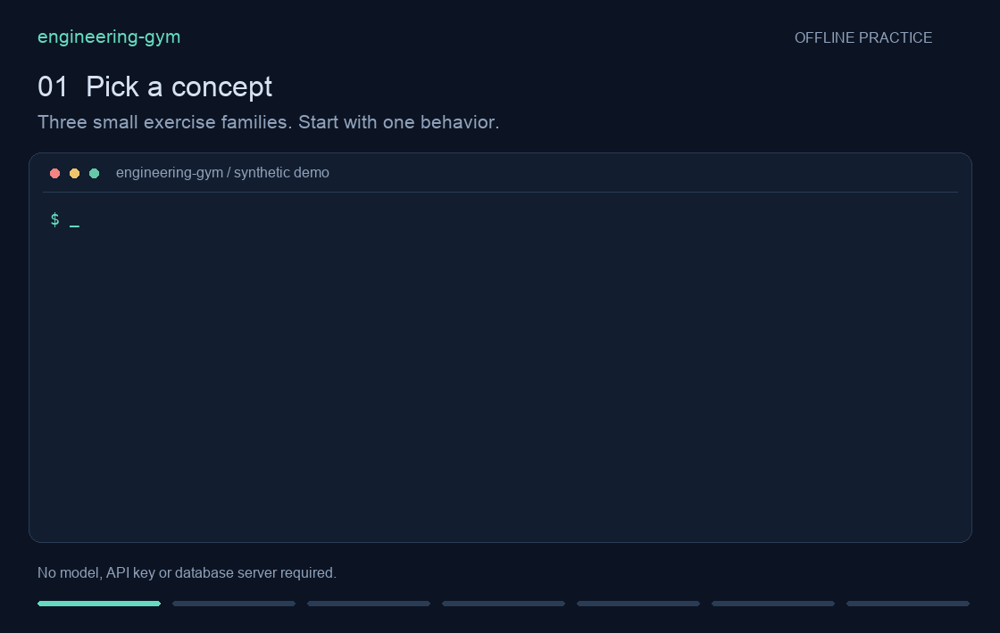
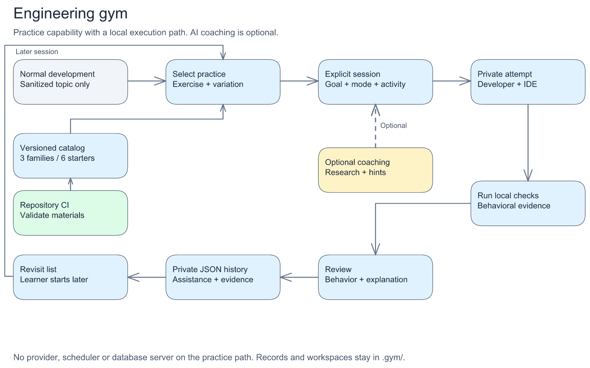
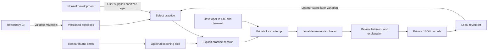
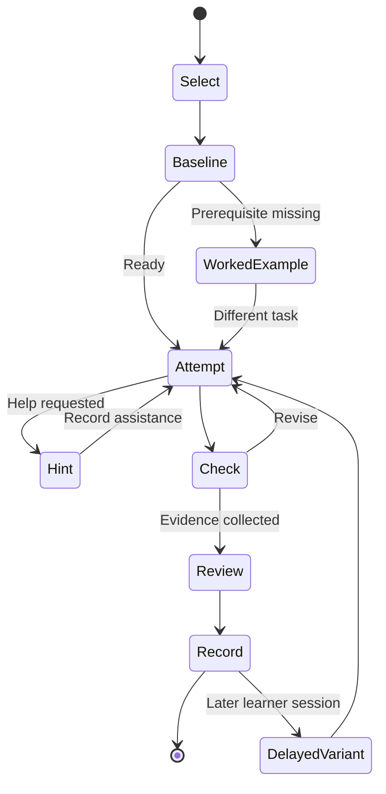

# engineering-gym

Keep the ability to build, debug, test and explain software yourself. Practice a
small problem, record the help you used, then try a changed problem later.
AI coaching is optional. No dashboard, backend, scheduler or paid service.

## See it in action



A synthetic session using real CLI results, with output shortened for readability.
[Still preview](examples/demo/walkthrough.png) · [Commands and use cases](examples/README.md)

## First independent session

Use Node **24.12+ within 24.x** (`.node-version` pins 24.21.0).
[Native TypeScript](https://nodejs.org/docs/latest-v24.x/api/typescript.html) and
[built-in SQLite](https://nodejs.org/docs/latest-v24.x/api/sqlite.html) keep runtime
dependencies at zero. SQLite is a release-candidate API; CI pins the runtime.

```sh
npm ci --ignore-scripts             # one-time install for repository type checking
npm run gym -- list
npm run gym -- start duplicate-delivery --mode independent --id first-session
# Read .gym/first-session/workspace/README.md; predict before running.
# Close the agent, disable generative completion, and edit workspace/starter/solution.ts.
npm run gym -- check first-session
# Edit .gym/first-session/review.json with actual evidence and a revisit date.
npm run gym -- record first-session
npm run gym -- due
```

The untouched starter intentionally fails acceptance. Exit codes: `0` pass/success,
`1` exercise check failure, `2` invalid command/state. Use a new ID for each attempt.
Docs, debugger and ordinary editor completion are allowed in independent mode.
Every core command works offline with Node alone, even without `node_modules`.
`npm run validate` needs the installed development dependencies.

| Exercise | Practice | Later variation |
| --- | --- | --- |
| [duplicate-delivery](exercises/duplicate-delivery/README.md) | Retries, interleaving, persistence | `rollback`: fault during a local write |
| [slow-query](exercises/slow-query/README.md) | Query semantics and index plans | `recent`: a changed filter |
| [unfamiliar-module](exercises/unfamiliar-module/README.md) | Predict and repair async ordering | `cancel`: drain active work, then stop |

For example: `npm run gym -- start slow-query --variation recent --goal deepen`.
[More use cases](examples/README.md) cover maintaining, deepening and expanding a skill.

## Optional coach

In an agent with this checkout available, say:

> Read `skills/practice/SKILL.md`. Use this checkout as the gym root. Give me
> a coached debugging exercise, with hints instead of a finished implementation.

The [portable skill](skills/practice/SKILL.md) needs no global installation for this
invocation. In another checkout, supply the gym path or `ENGINEERING_GYM_ROOT`.
Installing only the skill does not install exercises. Host behavior varies;
[coaching scenarios](examples/coaching-scenarios.json) await live-model evaluation.

- **Guided:** learn a prerequisite with an example, then attempt a different task.
- **Coached:** attempt first, request progressively stronger hints.
- **Independent:** no generated implementation or hints during the attempt; review afterward.

To switch: `npm run gym -- assist first-session --mode coached --hint "What I was told"`.
Add `--solution` after answer exposure. Assistance stays in history. Independence
is self-reported, never certified. Passing tests alone does not prove understanding.

## Local records

`.gym/` is gitignored: workspaces, metadata, editable reviews and append-only
history. Revisit dates are optional and use UTC. Malformed data stops with an error.
See [record examples](examples/README.md); `npm run gym -- help` lists history,
export and deliberate deletion commands. Keep exports outside Git.

Use synthetic data or approved sanitized topics. Nothing scans other repos, sends
telemetry or calls a model. Check processes omit inherited credentials; learner
code remains trusted local code, not a security sandbox.

## How it fits



Editable [Excalidraw diagrams and use cases](examples/README.md) are stored locally.


<details>
<summary>Architecture and learning loop (Mermaid)</summary>





</details>

## Evidence and contributing

The [research notes](skills/practice/references/learning-strategies.md) distinguish
published findings from our engineering adaptations, and discuss VibeWise and the
linked LDX3 talk. Confidence is high in the scoped source summaries, medium in
this untested adaptation. This is not a proven cure for “brainrot,” an optimal
manual-coding quota, or a guarantee of employability.

`npm run validate` runs strict type checking and material-integrity tests: helper
errors, private records, skill metadata/links, exact starter failures, references,
and selected wrong implementations. [CI boundaries](examples/diagrams/integrity.png)
exclude personal attempts and live-model calls. Mermaid syntax and Excalidraw
previews were checked during authoring; CI checks stored assets and source parity.

To add an exercise, copy an existing family's structure: versioned metadata,
instructions, starter, separate reference, named acceptance cases and exact
baseline failure names. Add a wrong-implementation check to
`tests/integrity.test.ts` and run validation. Bump the exercise version when its
contract changes; older attempts require the matching catalog version.
