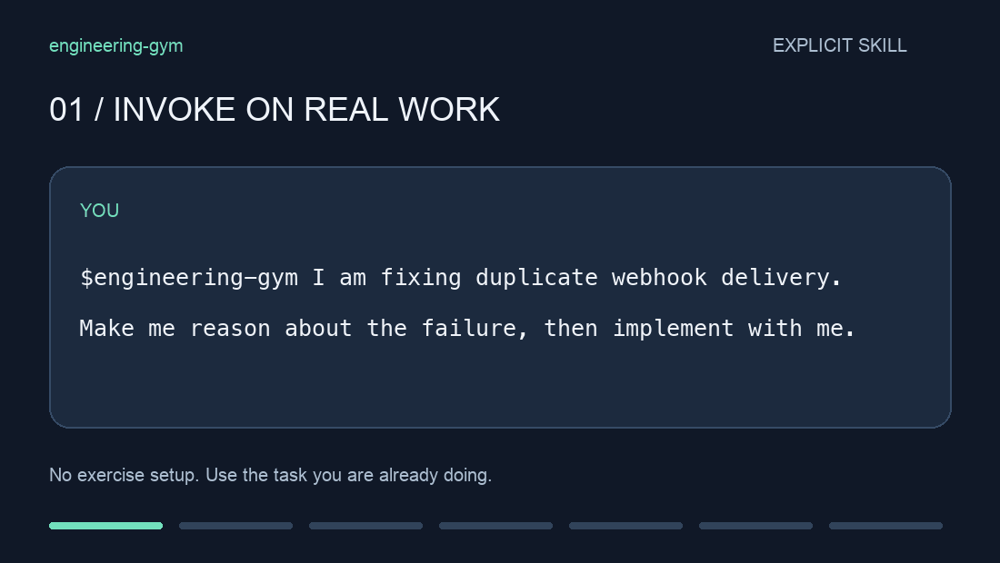
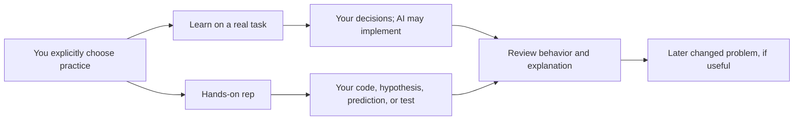

# engineering-gym

Two opt-in skills for keeping engineering ability in use while working with AI. The test is simple: **can you solve a related problem later with less help, and explain why it works?** A correct AI-written patch today is useful delivery, but it does not answer that question.

| Invoke | Your work | AI's role |
| --- | --- | --- |
| `$engineering-gym` | Reason through consequential design, diagnosis, and verification choices on a real task | Challenge the approach, explain gaps, then implement and test if requested |
| `$engineering-rep` | Build, debug, predict execution, or design a test yourself | Set a focused target, provide checks or hints at the chosen assistance level, then review your evidence |

For example, during a normal bug fix:

```text
$engineering-gym I'm fixing duplicate webhook delivery. Help me reason through the invariant and race, then implement with me.
```

Later, to exercise the ability yourself:

```text
$engineering-rep Give me an independent debugging rep on concurrent retries. Use synthetic data and runnable checks.
```

The first skill uses the real task; AI can write code. The second makes you contribute code or a diagnostic experiment before seeing a solution. It generates a synthetic scenario only when you ask for one. For a new topic, request *guided* teaching; for a familiar topic, use *independent* practice; ask for *coached* hints when needed. Switching modes is fine and recorded honestly in the conversation.



This is an illustrative conversation, not a live model evaluation. [Still image](examples/demo/daily-workflow.png) · [More use cases](examples/README.md).

## Install and use

The skills follow the [Agent Skills format](https://agentskills.io/specification). Codex finds them automatically when opened in this checkout. To invoke them from your other repositories, run once **from this repo**:

```sh
mkdir -p "$HOME/.agents/skills"
ln -s "$PWD/.agents/skills/engineering-gym" "$HOME/.agents/skills/engineering-gym"
ln -s "$PWD/.agents/skills/engineering-rep" "$HOME/.agents/skills/engineering-rep"
```

Inspect an existing destination before linking over it. Restart Codex if newly linked skills do not appear. [Codex's current docs](https://developers.openai.com/codex/skills) confirm repository/user locations, symlink support, and explicit `$skill` invocation. Other agents need their own skill discovery setup. No installation was made outside this repo.

The assisted route requires the agent you already use. A synthetic hands-on attempt can run offline **after** its starter and checks are prepared with installed local tools. There is no new API key, backend, telemetry, exercise catalog, or mandatory journal.



[Editable Excalidraw diagram](examples/diagrams/daily-workflow.excalidraw) · [PNG preview](examples/diagrams/daily-workflow.png)

Both skills are explicit-only. They do not collect employer code, customer data, production logs, secrets, transcripts, or entire repositories into this project. Use an approved sanitized summary for a portable challenge. The prior exercise prototype's ignored `.gym/` attempts remain local, but its CLI and catalog are retired; the code remains in Git history.

The approach takes inspiration from [VibeWise](https://github.com/nykooi1/vibe-wise): you own meaningful decisions while AI can implement. The separate hands-on skill covers what that assisted flow cannot demonstrate. The [research notes](.agents/skills/engineering-gym/references/learning-strategies.md) distinguish evidence from this untested adaptation and discuss the linked “coding is over” video. No study proves these skills prevent atrophy in senior engineers. If the practice becomes ceremony or fails to improve later independent work, change it or stop using it.
